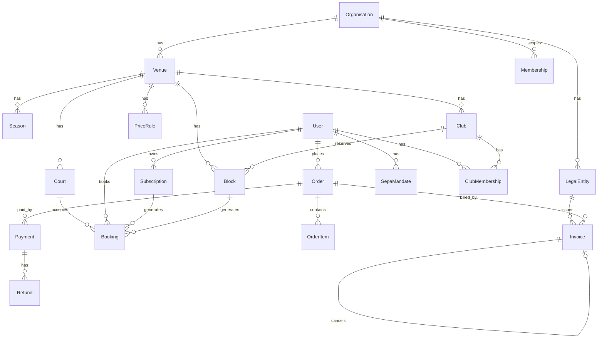

# Datenmodell `dtd-booking`

## Prinzipien

1. **Ein Belegungstyp.** Kundenbuchung, Dauerplatz-Termin und Sperre sind alle Zeilen in `Booking`. Ein Constraint schützt alles, Reports sind eine Query. `Subscription` und `Block` sind nur die Regeln, aus denen Belegungen materialisiert werden.
2. **Mandant überall.** Jede fachliche Tabelle hat `organisationId`. Prisma-Middleware oder Repository-Layer setzt den Filter; kein Query ohne.
3. **Geld in Cent, Zeit in UTC.** `Int` für Beträge, `DateTime` (timestamptz) für Zeitpunkte. Zeitzone `Europe/Berlin` nur in der Logik (Öffnungszeiten, Preisfenster, Anzeige).
4. **Immutable Finanzdaten.** `Invoice`, `Payment`, `Refund` werden nie verändert, nur ergänzt. Snapshots statt Fremdschlüssel, wo sich Stammdaten ändern können (Aussteller, Empfänger, Positionen).
5. **Soft-Delete.** Fachliche Datensätze werden storniert/deaktiviert/anonymisiert, nicht gelöscht.

## ER-Übersicht



## Entitäten

Notation: `feld: Typ` · `?` = optional · `*` = Index · `!` = unique. Alle Tabellen haben `id (cuid)`, `createdAt`, `updatedAt`; mandantenbezogene zusätzlich `organisationId*`.

### Stamm und Konfiguration

**Organisation** – Mandant (z. B. DTD)
`name` · `slug!` · `settings: Json` (Feature-Flags: paypalEnabled, confirmOnProcessing, sepaLeadDays)

**LegalEntity** – Rechnungsaussteller / Vertragspartner
`organisationId` · `name` · `legalForm` · `street, zip, city, country` · `taxNumber?` · `vatId?` · `iban?` · `bic?` · `creditorId?` (Gläubiger-ID, S3) · `invoicePrefix` (z. B. `PB`) · `defaultTaxRateBp: Int` (Basispunkte, 1900 = 19 %) · `smallBusiness: Boolean` (§ 19 UStG) · `email, phone, website?` · `stripeAccountId?` · `active`

**Venue** – Standort
`organisationId` · `legalEntityId` (aktueller Aussteller) · `name` · `slug!` · `street, zip, city` · `timezone` (`Europe/Berlin`) · `slotMinutes: Int` (30) · `minDurationMin` (60) · `maxDurationMin` (120) · `leadTimeMin` (60) · `horizonDays` (14) · `memberHorizonDays` (21) · `holdMinutes` (15) · `cancelHours` (24) · `cancelRefundMode: enum MONEY|CREDIT|NONE` · `releaseHoursBefore` (48) · `sepaLeadDays` (5) · `openingHours: Json` (`{ mon: [["08:00","22:00"]], … }`) · `closedDates: Json` (`["2026-12-24", …]`) · `termsVersion` · `active`

**Court** – Platz
`venueId*` · `name` · `sortOrder` · `courtGroup?` (z. B. „Feld 1–4" für Dauerplatz-Kontingente) · `sport: enum BEACH|TENNIS` · `active`

**Season**
`venueId*` · `name` · `startDate` · `endDate` · `presaleStart?` · `status: enum DRAFT|PRESALE|ACTIVE|CLOSED` · `subscriptionDiscountBp: Int` (Dauerplatz-Rabatt)

**Club** – Verein am Standort
`venueId*` · `name` · `contactEmail` · `active`

**PriceRule**
`venueId*` · `seasonId*` · `courtIds: String[]` (leer = alle) · `weekdays: Int[]` (1 = Mo … 7 = So) · `timeFrom` (`"17:00"`) · `timeTo` (`"22:00"`) · `pricePerHourCents` · `memberPricePerHourCents?` · `priority: Int` · `label` · `active`

### Nutzer und Vereinsbezug

**User**
`email!` · `name` · `phone?` · `passwordHash?` · `emailVerifiedAt?` · `billingStreet, billingZip, billingCity, billingCountry?` · `stripeCustomerId?` · `sepaBlocked: Boolean` · `termsAcceptedVersion?` · `termsAcceptedAt?` · `anonymizedAt?` · `notes?` (Admin)

**Membership** – Rolle in einer Organisation
`userId*` · `organisationId*` · `role: enum CUSTOMER|STAFF|ADMIN|SUPERADMIN` · `venueIds: String[]?` · unique (`userId, organisationId`)

**ClubMembership**
`userId*` · `clubId*` · `status: enum PENDING|ACTIVE|EXPIRED|REJECTED` · `memberNumber?` · `validUntil?` · `isClubAdmin: Boolean` · `verifiedByUserId?` · unique (`userId, clubId`)

**SepaMandate**
`userId*` · `provider: enum STRIPE|BANK` · `mandateRef!` · `ibanLast4` · `ibanEncrypted?` (nur BANK) · `bic?` · `accountHolder` · `signedAt` · `status: enum ACTIVE|REVOKED|FAILED` · `stripePaymentMethodId?`

### Belegung

**Subscription** – Dauerplatz (Regel)
`organisationId` · `venueId*` · `userId*` · `seasonId*` · `courtId*` · `weekday: Int` · `startTime` (`"19:00"`) · `durationMin` · `dateFrom` · `dateTo` · `skippedDates: Json` · `pricePerOccurrenceCents` · `totalCents` · `billingMode: enum UPFRONT|MONTHLY` · `status: enum PENDING|ACTIVE|CANCELLED` · `cancelledAt?` · `cancelReason?` · `orderItemId?`

**Block** – Sperre (Regel)
`organisationId` · `venueId*` · `courtId*` · `clubId?` · `type: enum VEREIN|LIGA|WARTUNG|EVENT|GESPERRT` · `title` · `startAt` · `endAt` · `rrule?` (RFC 5545, z. B. `FREQ=WEEKLY;BYDAY=MO,TU,WE,TH;UNTIL=20270430`) · `releaseHoursBefore?` (überschreibt Venue) · `createdByUserId`

**Booking** – jede Belegung eines Platzes
`organisationId` · `venueId*` · `courtId*` · `startAt*` · `endAt` · `kind: enum CUSTOMER|SUBSCRIPTION|BLOCK` · `status: enum HOLD|PENDING_PAYMENT|CONFIRMED|RELEASED|CANCELLED|EXPIRED|NO_SHOW` · `usageType: enum KOMMERZIELL|VEREIN|LIGA|INTERN` · `source: enum ONLINE|ADMIN|SUBSCRIPTION|BLOCK|RELEASE_RESALE` · `userId?` · `clubId?` · `subscriptionId?` · `blockId?` · `orderItemId?` · `priceCents?` · `priceBreakdown: Json?` · `holdExpiresAt?` · `confirmedAt?` · `clubConfirmedAt?` (Vereinsbestätigung des Kontingent-Termins, E4 – bestätigte Termine werden vom Freigabe-Cron nicht freigegeben) · `cancelledAt?` · `cancelledByUserId?` · `cancelReason?` · `label?` (Trainingsgruppe) · `note?`

Index: `(courtId, startAt)`, `(venueId, startAt)`, `(userId, startAt)`, `(status, holdExpiresAt)`.

### Bestellung, Zahlung, Rechnung

**Order**
`organisationId` · `venueId*` · `userId*` · `legalEntityId` · `number!` (`ORD-…`, nicht die Rechnungsnummer) · `status: enum DRAFT|AWAITING_PAYMENT|PROCESSING|PAID|PARTIALLY_REFUNDED|REFUNDED|FAILED|CANCELLED` · `currency` (`EUR`) · `subtotalCents` · `taxCents` · `totalCents` · `paymentMethodType?` (`sepa_debit|card|paypal|transfer|cash|credit`) · `stripeCheckoutSessionId?` · `stripePaymentIntentId?` · `paidAt?` · `billingSnapshot: Json` (Empfänger) · `termsVersion`

**OrderItem**
`orderId*` · `productType: enum SINGLE_BOOKING|SUBSCRIPTION|CREDIT_TOPUP|BLOCK_CARD|VOUCHER|FEE|MANUAL` · `description` · `servicePeriodFrom` · `servicePeriodTo` · `quantity` · `unitCents` · `taxRateBp` · `netCents` · `taxCents` · `grossCents` · `priceBreakdown: Json?` · `bookingId?` · `subscriptionId?`

**Payment**
`orderId*` · `provider: enum STRIPE|BANK_SEPA|MANUAL` · `providerRef?` (PaymentIntent / Mandatsreferenz+Datum) · `method` · `amountCents` · `status: enum PROCESSING|SUCCEEDED|FAILED|DISPUTED` · `failureCode?` · `receivedAt?` · `mandateId?`

**Refund**
`paymentId*` · `orderId*` · `amountCents` · `reason` · `providerRef?` · `status: enum PENDING|SUCCEEDED|FAILED` · `creditNoteInvoiceId?` · `createdByUserId`

**Invoice**
`organisationId` · `legalEntityId*` · `number!` (`PB-2026-000123`) · `type: enum INVOICE|CREDIT_NOTE` · `orderId*` · `userId*` · `relatedInvoiceId?` (bei CREDIT_NOTE) · `issueDate` · `servicePeriodFrom` · `servicePeriodTo` · `issuerSnapshot: Json` · `recipientSnapshot: Json` · `lines: Json` · `netCents` · `taxCents` · `grossCents` · `taxRateBp` · `pdfKey` · `pdfSha256` · `sentAt?` · `issuedAt`

**InvoiceSequence**
`legalEntityId*` · `year` · `lastNumber` · unique (`legalEntityId, year`)

**CreditLedger** (S3, Guthaben)
`userId*` · `organisationId` · `deltaCents` · `reason` · `refType?` · `refId?` · `expiresAt?`

### Technik

**WebhookEvent** – `provider` · `eventId!` · `type` · `payload: Json` · `receivedAt` · `processedAt?` · `error?`

**EmailLog** – `userId?` · `to` · `template` · `templateVersion` · `refType?` · `refId?` · `providerMessageId?` · `status` · `sentAt`

**AuditLog** – `organisationId` · `actorUserId?` · `entity` · `entityId` · `action` · `diff: Json` · `at`

## Kritische Constraints (SQL, als Custom-Migration)

```sql
CREATE EXTENSION IF NOT EXISTS btree_gist;

-- Keine zwei aktiven Belegungen auf demselben Platz überlappen.
ALTER TABLE "Booking"
  ADD CONSTRAINT booking_no_overlap
  EXCLUDE USING gist (
    "courtId" WITH =,
    tstzrange("startAt", "endAt", '[)') WITH &&
  )
  WHERE ("status" IN ('HOLD','PENDING_PAYMENT','CONFIRMED'));

-- Belegungsende nach Beginn, Raster eingehalten (30 min) – Raster zusätzlich in der App prüfen.
ALTER TABLE "Booking" ADD CONSTRAINT booking_period_valid CHECK ("endAt" > "startAt");

-- Rechnungsnummer eindeutig je Aussteller.
CREATE UNIQUE INDEX invoice_number_per_issuer ON "Invoice" ("legalEntityId", "number");

-- Webhook-Idempotenz.
CREATE UNIQUE INDEX webhook_event_unique ON "WebhookEvent" ("provider", "eventId");
```

`RELEASED` steht bewusst nicht in der Constraint-Liste: Eine freigegebene Vereinsbelegung bleibt für den Report sichtbar, blockiert aber nicht mehr. Wird der Slot kommerziell verkauft, entsteht eine zweite `Booking`-Zeile (`source = RELEASE_RESALE`) mit Referenz auf die freigegebene Zeile in `note`/`priceBreakdown`.

### Rechnungsnummer (transaktional)

```sql
-- innerhalb derselben Transaktion wie INSERT INTO "Invoice"
INSERT INTO "InvoiceSequence" ("legalEntityId","year","lastNumber") VALUES ($1,$2,0)
  ON CONFLICT DO NOTHING;
UPDATE "InvoiceSequence" SET "lastNumber" = "lastNumber" + 1
  WHERE "legalEntityId" = $1 AND "year" = $2
  RETURNING "lastNumber";
-- Nummer = prefix || '-' || year || '-' || lpad(lastNumber, 6, '0')
```

Schlägt die Transaktion nach dem Increment fehl, ist die Nummer verbraucht und die Rechnung nicht angelegt → Lücke. Deshalb: Increment als letzter Schritt vor dem Commit, PDF-Rendering davor.

## Zustandsautomaten

**Booking (kind = CUSTOMER)**
`HOLD` → `PENDING_PAYMENT` (Checkout gestartet) → `CONFIRMED` (Zahlung ok oder SEPA processing) → `CANCELLED` | `NO_SHOW`
`HOLD` → `EXPIRED` (Cron, `holdExpiresAt` überschritten)
`PENDING_PAYMENT` → `EXPIRED` (Session abgelaufen) | `CANCELLED` (Zahlung fehlgeschlagen)

**Booking (kind = SUBSCRIPTION)**
Materialisiert als `CONFIRMED` bei Aktivierung des Dauerplatzes → `CANCELLED` (Kündigung, Freigabe, Schließtag nachträglich)

**Booking (kind = BLOCK)**
Materialisiert als `CONFIRMED` (`usageType` = Blocktyp) → `RELEASED` (Cron, Freigabefrist erreicht und nicht bestätigt) → bleibt `RELEASED`
Bestätigt der Vereins-Admin einen Termin, wird `confirmedAt` gesetzt; der Cron überspringt ihn.

**Order**
`DRAFT` → `AWAITING_PAYMENT` → `PAID` (Karte/PayPal) oder `PROCESSING` (SEPA) → `PAID` | `FAILED`
`PAID` → `PARTIALLY_REFUNDED` → `REFUNDED`
`DRAFT`/`AWAITING_PAYMENT` → `CANCELLED`

Rechnung wird bei `PAID` erzeugt, bei `confirmOnProcessing = true` bereits bei `PROCESSING`. Bei `FAILED` nach `PROCESSING`: Gutschrift + Buchungen `CANCELLED` + `User.sepaBlocked = true`.

## Preisberechnung (serverseitig, deterministisch)

```
computePrice(venue, season, court, startAt, endAt, isMember):
  slots = teile [startAt, endAt) in venue.slotMinutes-Slots (lokale Zeit Europe/Berlin)
  for slot in slots:
    rules = PriceRule where seasonId, active,
            (courtIds leer oder enthält court.id),
            weekday(slot) in weekdays,
            timeFrom <= slot.start < timeTo         -- Fenster über Mitternacht nicht erlauben
    rule = argmax(rules.priority)                    -- kein Treffer → Fehler „kein Preis"
    rate = isMember && rule.memberPricePerHourCents ? member : normal
    slotCents = round(rate * venue.slotMinutes / 60)
    breakdown.push({slot, ruleId, rate, slotCents})
  net = sum(slotCents)
  return { netCents: net, breakdown }
```

Dauerplatz: `occurrences = alle Termine im Zeitraum minus closedDates`; `totalNet = round(sum(occurrence.net) × (1 − discountBp/10000))`; `pricePerOccurrenceCents = totalNet / occurrences` (Rest auf letzten Termin). Steuer wird auf Positionsebene berechnet: `tax = round(net × taxRateBp / 10000)`.

Preise sind Bruttopreise gegenüber Endkunden. Die Regel speichert daher **Brutto**; Netto und Steuer werden bei Bestellung rückgerechnet (`net = round(gross × 10000 / (10000 + taxRateBp))`). Entscheidung bei Setup festhalten; nicht mischen.

## Vereinsnutzungs-Report (L3)

```sql
WITH b AS (
  SELECT "usageType", "status",
         SUM(EXTRACT(EPOCH FROM ("endAt" - "startAt")) / 3600.0) AS feldstunden
  FROM "Booking"
  WHERE "venueId" = $venue
    AND "startAt" >= $from AND "startAt" < $to
    AND "status" IN ('CONFIRMED','RELEASED','NO_SHOW')
  GROUP BY 1, 2
)
SELECT
  SUM(feldstunden) FILTER (WHERE "usageType" IN ('VEREIN','LIGA'))                          AS verein_vorhaltung,
  SUM(feldstunden) FILTER (WHERE "usageType" IN ('VEREIN','LIGA') AND "status" <> 'RELEASED') AS verein_auslastung,
  SUM(feldstunden) FILTER (WHERE "usageType" = 'KOMMERZIELL')                               AS kommerziell,
  SUM(feldstunden) FILTER (WHERE "usageType" = 'INTERN')                                    AS intern,
  SUM(feldstunden) FILTER (WHERE "status" <> 'RELEASED')                                    AS belegt_gesamt
FROM b;
```

Verfügbare Feldstunden (Nenner a) werden aus `openingHours × aktive Courts × Tage − closedDates` in der App berechnet. Ausgewiesen werden vier Quoten:

| | Nenner: Öffnungs-Feldstunden | Nenner: belegte Feldstunden |
|---|---|---|
| **Vorhaltung** | `verein_vorhaltung / verfügbar` | `verein_vorhaltung / (belegt_gesamt + released)` |
| **Auslastung** | `verein_auslastung / verfügbar` | `verein_auslastung / belegt_gesamt` |

Der Report druckt die Definitionen mit ab. Welche Quote gegenüber dem Sportamt gilt, ist eine politische Entscheidung, keine technische.

## Seed für Winter 1 (Vorschlag, nach Vorvertrag anpassen)

- Organisation `dtd`, LegalEntity `DoThingsDigital GmbH` (Plan A) und `Beachclub-Köln e.V.` (Plan B, inaktiv)
- Venue `picco-beach`, Courts `Feld 1 … Feld N` (N aus Hallenszenario), Öffnungszeiten Mo–Fr 08–22, Sa–So 09–21
- Season `Winter 2026/27`, 01.10.2026 – 31.03.2027 (Enddatum nach Standzeit-Genehmigung)
- Club `Beachclub-Köln e.V.`
- Block `Vereinskontingent`: Courts A und B, `FREQ=WEEKLY;BYDAY=MO,TU,WE,TH`, 18:00–22:00, `type=VEREIN`; Beach-Liga-Slots separat
- PriceRules: Off-Peak Mo–Fr 08–17, Peak Mo–Fr 17–22, Wochenende ganztags; Werte aus Kalkulationstool v2
